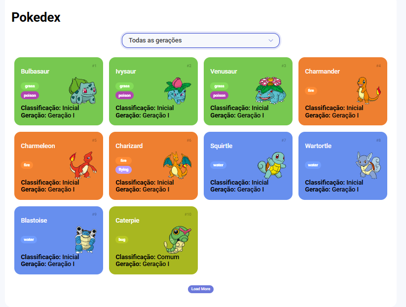
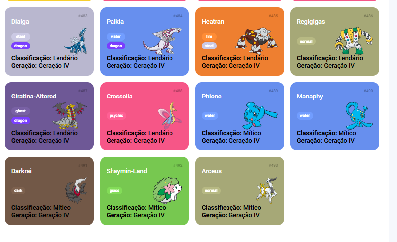
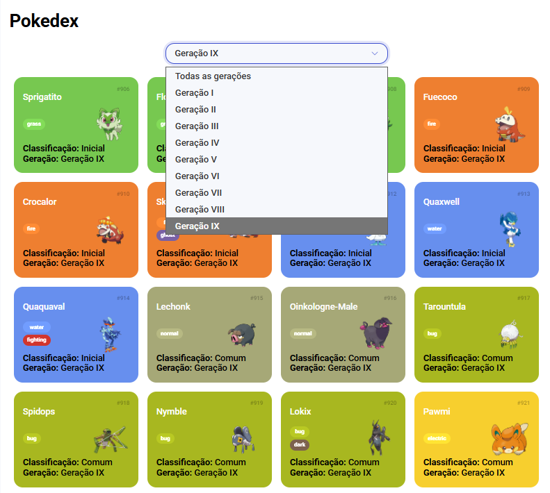

# Trilha JS Developer - Pokedex

[Link do Site](https://gustavopereira-dev.github.io/js-developer-pokedex/)

Pokédex com JavaScript e API

Este sistema é uma Pokédex web que consome dados da PokeAPI para exibir Pokémon com informações detalhadas e personalizadas, incluindo:
- Tipos
- Imagem oficial
- Geração
- Classificação especial (Inicial, Pseudo-Lendário, Lendário, Mítico, Comum)

## Classificações Especiais
A Pokédex aplica uma lógica customizada baseada em regras da comunidade e dados da API (ainda que algumas futuramente devem ser adicionadas):

| Classificação | Critério                       |
----------------|--------------------------------|
|Mítico         | is_mythical: true na espécie   |
|Lendário       | is_legendary: true na espécie  |
|Inicial        | Cadeia evolutiva inicia com Pokémon do tipo Grass, Fire ou Water |
|Pseudo-Lendário| Cadeia de 3 estágios, stats totais do estágio final >= 600 |
|Comum          |Caso não se enquadre nos critérios acima|

## Estrutura de Arquivos JavaScript

- pokemon-model.js: Define a classe Pokemon com propriedades como name, types, etc.
- poke-api.js: Contém a lógica de conversão dos dados da PokeAPI e classificação
- main.js: Lida com a renderização dos cards e eventos como seleção de geração

## Fluxo de Dados
1. main.js solicita Pokémon por página ou por geração.
2. poke-api.js busca detalhes e transforma em objetos Pokemon.
3. Classificação é aplicada via classificarPorCadeia() considerando a cadeia evolutiva.
4. Os cards são renderizados no HTML com tipo, imagem, geração e classificação visível.

## Tecnologias Utilizadas

- JavaScript Vanilla para lógica e DOM
- Fetch API para requisições assíncronas à PokeAPI
- HTML/CSS para estrutura visual e interatividade
PokeAPI como fonte primária de dados

## Funcionalidades Extras
- Filtro por geração via <code> select </code>
- Paginação com botão “Carregar mais”
- Exibição dinâmica com imagens oficiais
- Tratamento inteligente de erros (Pokémon ausente, formas alternativas inválidas)

